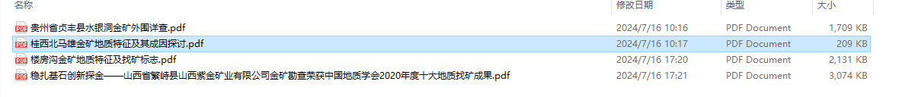

基于开源仓库书写工具：

[opendatalab/MinerU: A high-quality tool for convert PDF to Markdown and JSON.一站式开源高质量数据提取工具，将PDF转换成Markdown和JSON格式。](https://github.com/opendatalab/MinerU)

---

(MinerU) D:\c_projectss\03_PFN\1_dataGet\9.1_MinerU>

配置文件：C:\Users\name\magic-pdf.json 【修改模型地址和结果输出地址和是否使用cuda】

magic-pdf.json：配置文件备份

PDF-Extract-Kit：存放模型文件

---

[MinerU PDF 文档提取 Demo （PDF解析）-CSDN博客](https://blog.csdn.net/shizidushu/article/details/140503124)

首先运行 `magic-pdf pdf-command --help`，看一下这个命令行有哪些参数

Usage: magic-pdf pdf-command [OPTIONS]

Options:
  --pdf PATH               PDF文件的路径  [required]
  --model PATH             模型的路径
  --method [ocr|txt|auto]  指定解析方法。txt: 文本型 pdf 解析方法， ocr: 光学识别解析 pdf, auto:
                           程序智能选择解析方法
  --inside_model BOOLEAN   使用内置模型测试
  --model_mode TEXT        内置模型选择。lite: 快速解析，精度较低，full: 高精度解析，速度较慢

---

activate MinerU

单篇：

magic-pdf pdf-command --pdf "pdf1/巴基斯坦查盖地区西段斑岩型...金矿遥感地质特征及找矿预测_蒲小楠.pdf" --inside_model true --model_mode full

magic-pdf pdf-command --pdf "pdf1/贵州省贞丰县水银洞金矿外围详查.PDF" --inside_model true --model_mode full

单独脚本实现整个文件夹的pdf逐个转换：python main.py

---

原本大写PDF后缀，无法识别的改成小写pdf后缀：

部分硕士论文和其他pdf文件 因为太长哈还是什么转化失败没有md文件 需要WPS转成图片pdf重新运行

---

参考：

[MinerU - 搜索 (bing.com)](https://www.bing.com/search?q=MinerU&gs_lcrp=EgZjaHJvbWUyBggAEEUYOTIGCAEQRRg9MgYIAhBFGD2oAgCwAgA&FORM=ANCMS9&adppc=EDGEESS&PC=U531&mkt=zh-CN)

[MinerU PDF 文档提取 Demo （PDF解析）-CSDN博客](https://blog.csdn.net/shizidushu/article/details/140503124)

[opendatalab/MinerU: A one-stop, open-source, high-quality data extraction tool, supports PDF/webpage/e-book extraction.一站式开源高质量数据提取工具，支持PDF/网页/多格式电子书提取。 (github.com)](https://github.com/opendatalab/MinerU/tree/master)

[开源工具-Opendatalab](https://opendatalab.com/OpenSourceTools)

[opendatalab/PDF-Extract-Kit: A Comprehensive Toolkit for High-Quality PDF Content Extraction (github.com)](https://github.com/opendatalab/PDF-Extract-Kit)
